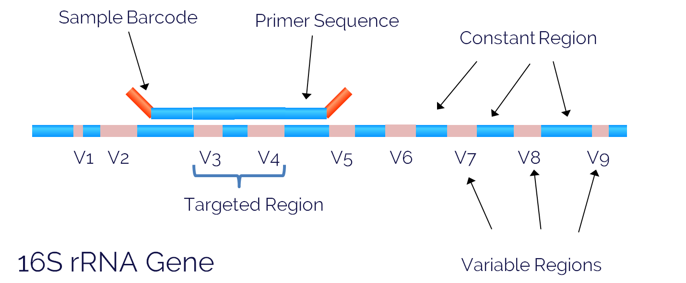

### This site is under construction !!!! Not reliable yet.

## What is 16S amplicon sequencing?

16S amplicon sequencing is commonly used for identifying and classifying bacteria within a particular environment. It allows us to use a small region of DNA from the genome of each bacterium in a sample to determine which microbes are present and perform microbial diversity analyses to help us understand the microbial ecosystem.  

### 16S rRNA gene

The 16S ribosomal RNA gene (16S rRNA) is approximately 1,500 bp long, and contains nine variable regions separated by conserved regions. We use the variable regions of the gene to distinguish one bacterial type from another. One of the most commonly sequenced variable regions is the V3 - V4 region that spans approximately 469 bp (Fadrosh et al. 2014. Microbiome).   

One reason this region is a popular sequencing target is the length. Often we use paired-end 250 bp sequencing, which allows us to span more than half of the V3-V4 region in each direction. This means we can stitch the paired reads together to produce a longer sequence read that increases the accuracy and specificity of our data.   

